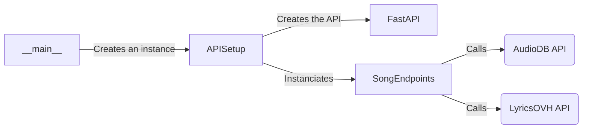

# :notes: Playlist Maker :notes:

## Features

- Create a random playlist based on your taste
- Config availabe for the playlist size
- Random song feature
- A log to debug the app
- Unit testing

## How to install
### Dependencies
First, make sure to install the dependencies for the server using `pip install -r requirements.txt`. The first file is located in the `webservice` folder. The second one is located in the `client` folder. The requirements is split in two in order to be able to run the webservice on a computer and the client on another one.

### Config

The project relies on other webservice to work. AudioDB features an api key system. For this example we use the key `2` which is a testing key. If you want you can subscribe to the service of AudioDB to have a production key. You will be able to change it in the `.env` file.

### Run the project

To run the API you have to run the file `__main__.py` in the web_service folder. You will have the address of the local server.

You can use the file `info.log` to debug.

To use the client you can run the file `__main__.y` in the client folder. Note : This main file is directly launching an demo playlist with a pre-created file. If you want to use your own file you can import the `MainClient` object situated in core. You can then use the `create_playlist` method to create your own playlist. The `create_playlist` method requires 3 arguments :

- preference_dict : dict
            The dict containing the preferences for artist

- web_service_url : str
            The url of the webservice to contact it

- playlist_size : int
            The size of the playlist to create
## How it works

The webservice uses two API to collect data on artists and songs. Those two API are :

- [AudioDB](https://www.theaudiodb.com/) : Big webservice featuring info on artists,albums and songs

- [LyricsOVH](https://lyrics.ovh/) : Provides lyrics associated to a song
  
### Architecture

Architecture du webservice

### Unit testing

